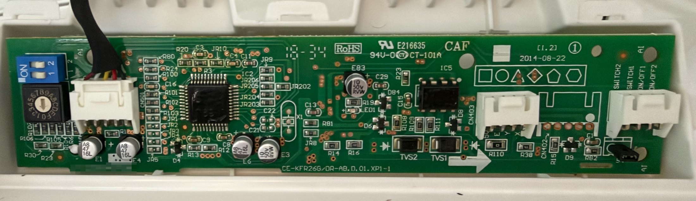
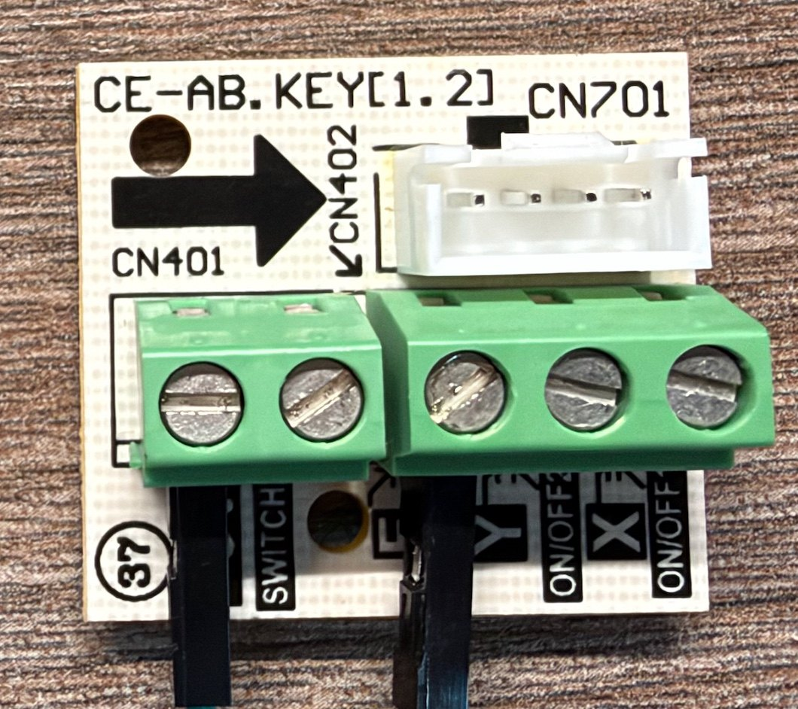

# Remko MXW → ESPHome

Control **Remko MXW** split air conditioners from Home Assistant — locally, with
no cloud, no vendor account, and **without modifying the unit**.

The connection is the **XYE bus on connector CN403**: the port the manufacturer
itself provides for its MCC-1 central controller. Original cable, original
breakout, screw terminals. Removing it again means unplugging a connector.

These are the "old" MXW units built before 07/2021 — the ones the official WiFi
stick does not support. They turn out to be fully controllable anyway, with
complete feedback.

| | |
|---|---|
| **Units** | Remko MXW 204 / 264 / 354 / 524, multi-split, 2019 |
| **Interface** | XYE / RS-485 over CN403 (the MCC-1 connector) |
| **Hardware per unit** | LILYGO T-CAN485 — ESP32 and RS-485 transceiver on one board, ~20 € |
| **Power** | 5 V from CN403, no separate PSU |
| **Feedback** | full — actual temperatures, fan speed, compressor, defrost, error flags |
| **Home Assistant** | ESPHome native API, encrypted |
| **Status** | running in daily use |



*The board everything hinges on. Left: the address switches S1 (DIP) and S2
(rotary) and CN501, occupied by the ribbon to the main board. Right: **CN403**,
free, silkscreened `5 E Y X`, with **IC5** (the RS-485 transceiver) right next
to it, TVS1/TVS2 for surge protection and R110/R38 in the A/B lines. A complete,
protected RS-485 interface, populated at the factory — not an empty footprint.*

Underneath is a **Midea OEM board**. If your indoor unit has a connector
labelled `X · Y · E` with a rotary address switch next to it, this applies to
you whatever name is on the front — Remko is one of many brands on that
platform.

---

## What this repository is

Two things, and you may only want one of them.

**A build you can copy.** Four screw terminals, one ESPHome package, done.
Start at [Quick start](#quick-start).

**A write-up of how it was worked out.** The protocol analysis, the
measurements, the dead end and why it was abandoned. Start at
[docs/](docs/). The analysis is in German; every document opens with an English
summary. Configuration and code are English throughout.

---

## The findings

### 1. The connector you need is already there

The project started out aiming to tap the **XT path** — the one-way wire that
carries the demodulated IR command to the display board. That would have meant
splicing an occupied cable, building a level shifter, and **never learning what
the unit is doing**.

The better route was **CN403**: the MCC-1 connector, bidirectional, populated,
free, with address switches. The original cable and breakout shipped with the
unit.

**The lesson:** before reimplementing a protocol, ask whether the manufacturer
already provides an interface. The invasive path was not just worse — it was
unnecessary.

### 2. One continuity check decided the whole project

Whether CN403 was usable came down to one question: **can the unit transmit on
the bus, or is it only allowed to listen?** One pin decides that.

The transceiver is a **TI SN65HVD3088E**. Its pin 3 (`DE`, driver enable) was
measured against ground:

| Measurement | Result | Meaning |
|---|---|---|
| IC5 pin 3 (`DE`) → GND | **no continuity** | enable is driven by the MCU → **the unit can transmit** |
| IC5 pin 2 (`/RE`) → GND | continuity | receiver permanently active, normal |

Had `DE` been tied low, the bus would have been read-only for the indoor unit
and the whole idea dead. **Five minutes with a continuity tester de-risked a
week of work** — before a single part was ordered.

### 3. The "proprietary" IR protocol is Coolix

The XT bit stream is not a Remko invention. Strip the bit-grid encoding and 24
payload bits remain that match ESPHome's built-in **Coolix** codec exactly.
Cross-checked with a purpose-built encoder against every array published in the
reference projects:

```
VALIDATION: 24 match, 0 mismatch (of 24)
```

Reproduced byte for byte. So no command table is needed in code — and the units
accept more than the reference projects showed: **17–30 °C, not 17–24 °C**.

**The irony:** this result is no longer needed. Finding 1 made the whole path
obsolete. The work is complete in [`legacy-xt/`](legacy-xt/) and
[`ir/`](ir/) — a solid plan B, and a command table that is useful on its own.

### 4. The unit powers the ESP32 itself — including in standby

CN403 carries 5 V next to X/Y/E. Whether that tolerates an ESP32 is
undocumented, so it was measured rather than estimated:

* ESP32-WROOM **without a bulk capacitor** — no brownout, 0 % ping loss
* also at **maximum cooling**, when the most inside the unit is running
* **standby verified:** 5 V stays on when the unit is switched off by remote.
  Uptime runs without a gap

That last one is the measurement that actually matters. If the rail went dead in
standby, the ESP could **never switch the unit back on** — a remote control that
locks itself out. Result: **no PSU, no capacitors, four wires.**

### 5. Not everything the remote can do appears on the bus

All 30 bytes were observed across 46 status frames:

| Function | On the XYE bus? | Consequence |
|---|---|---|
| Mode, setpoint, fan speed | yes, read **and** write | full control |
| Actual temperatures, compressor, defrost, errors | yes, read | real feedback |
| **Swing** | passive only | set it once with the remote, Home Assistant then carries it along |
| **Display brightness, beeper** | **no**, not a single byte changes | remote only |

Swing in detail: if the ESP sets the flag, the unit acknowledges it — but **does
not move the louvre** and clears the flag after ~4 s. The louvre motor belongs
to the display board; XYE only mirrors the state. Set swing once with the
remote and it stays: across four minutes and two full off/on cycles from Home
Assistant, `mode_flags` remained `0x04` throughout.

Useful side finding: **the beeper stays off permanently.** After an off/on
cycle the display comes back, the beep does not.

### 6. One board instead of three parts

The original build was an ESP32 DevKit plus an XY-485 module plus a breadboard,
with series resistors in the TTL lines to survive the inconsistent `RXD`/`TXD`
labelling on those modules. Replaced by the **LILYGO T-CAN485**: ESP32 and
transceiver on one board, screw terminals for bus and power. **Four terminals,
nothing to solder.**

The price: the board's three enable pins have to be set in YAML —
`GPIO16/17/19`, all active-low. They sit in the package as `output:` and are
never switched; ESPHome drives them OFF at startup, which with `inverted: true`
means physically HIGH. Leave that out and the transceiver stays mute with
**nothing in the log to hint at why**.

---

## Quick start

**1. Check your unit.** Take off the front panel — that is *not* opening the
unit — and look for a 4-pin connector `5V · E · Y · X` with a rotary address
switch and a DIP switch beside it. An SO-8 with two TVS diodes in front of it
means you have a populated RS-485 interface.

**2. Flash at the desk**, over USB, with no AC unit attached:

```bash
cd esphome
cp secrets.yaml.example secrets.yaml     # fill in the values
cp example-room.yaml ac-livingroom.yaml  # set device_name and room
esphome run ac-livingroom.yaml
```

**3. Unplug USB.** Never together with the 5 V supply from CN403 — the board
would feed back into the unit's rail through its regulator.

**4. Kill the breaker for the indoor unit** and verify it is dead.

**5. Four terminals:**



*The `CE-AB.KEY(1.2)` breakout that shipped with the unit. `CN701` takes the
original CN403 cable, the green terminal block brings out `X · Y · E · 5V` on
screws. Nothing is cut, nothing is soldered.*


| CN403 cable | Signal | T-CAN485 |
|---|---|---|
| **brown** | 5V | `POWER DC 5~12V` **+** |
| **white** | E (ground) | `POWER DC 5~12V` **−** |
| **red** | X | `RS-485` **A** |
| **yellow** | Y | `RS-485` **B** |

Wire colours measured on the original Remko cable — **ring out every new pigtail
anyway** before putting 5 V on it. Before switching on: there must be **no**
continuity between brown and white.

**6. Power up and read the log:**

| Line | Meaning |
|---|---|
| `>>> AA C0 00 ...` | the ESP is polling, transmit direction works |
| `<<< 00 00 00 ...` | **noise**, no answer — a floating RX pin reads constant zero |
| **`<<< AA ...`** ending in `55` | **a real answer from the indoor unit — pass** |
| `XYE address` appears | `auto_discover` found the unit |
| only `>>>`, never `<<<` | no answer → swap `A`/`B` |

Full procedure, pre-power continuity checks, troubleshooting and safety notes:
[docs/02-xye-inbetriebnahme.md](docs/02-xye-inbetriebnahme.md).

---

## Repository layout

| Path | Contents |
|---|---|
| [`esphome/`](esphome/) | the configuration in use — one shared package, one small file per unit |
| [`docs/`](docs/) | the analysis: hardware, wiring, measurements, protocol, decisions |
| [`ir/`](ir/) | 148 IR/XT commands as Coolix codes and ready-made frames |
| [`legacy-xt/`](legacy-xt/) | the abandoned wired path: ESPHome component and example configs, kept as plan B |
| [`enclosure/`](enclosure/) | which printed case is used and how to print it for this spot |
| [`tools/`](tools/) | generator for self-contained ESPHome dashboard configs |

---

## Safety

Inside the unit there is mains voltage.

* **Kill the breaker for the indoor unit, secure it, and verify it is dead**
  before touching anything. On a multi-split, each indoor unit may have its own
  supply — find the right one.
* **Never USB and the 5 V terminal at the same time.**
* Ring out before powering: no continuity between 5 V and E.
* **Never touch the refrigerant circuit.** This is an electronics-only job in
  the display area.
* Keep the board out of the air path and **never above the condensate tray**.
* **Print the case in PETG or ASA, not PLA** — behind the front panel it gets
  hotter in heating mode than PLA tolerates.
* Opening a unit may affect your warranty. Using the provided connector changes
  nothing on the unit, but if you have an active manufacturer warranty or a
  service contract, ask first.

This is a private hobby project, published in the hope it is useful. No
affiliation with Remko or Midea. You are working on your own equipment at your
own risk — see the [licence](LICENSE).

---

## Dependencies

The XYE support comes from an external ESPHome component, pinned to a fixed
version:

```yaml
external_components:
  - source:
      type: git
      url: https://github.com/HomeOps/ESPHome-Midea-XYE
      ref: v0.2.18
    components: [midea_xye]
```

**Bump that version deliberately, not in passing.** Read the release notes
first.

## Credits

* [HomeOps/ESPHome-Midea-XYE](https://github.com/HomeOps/ESPHome-Midea-XYE) —
  the ESPHome component that does the actual work
* [codeberg.org/xye/xye](https://codeberg.org/xye/xye) — XYE protocol
  documentation
* [Bunicutz/ESP32_Midea_RS485](https://github.com/Bunicutz/ESP32_Midea_RS485)
  and [wtahler/esphome-mideaXYE-rs485](https://github.com/wtahler/esphome-mideaXYE-rs485)
  — earlier XYE work
* [andineise/remko2mqtt](https://github.com/andineise/remko2mqtt) — the wired XT
  path and the byte arrays that made the Coolix analysis possible
* [LasseBang](https://makerworld.com/de/models/2410211-compact-enclosure-for-lilygo-t-can485-rs485)
  — the T-CAN485 enclosure

## Contributing

Reports from other units are the most useful thing you can contribute. If you
run this on a different MXW model, a different Remko series, or another brand on
the same Midea platform, open an issue saying what worked and what did not — in
English or German, either is fine.

## Licence

[MIT](LICENSE) © 2026 Dennis Alexander Holtz
