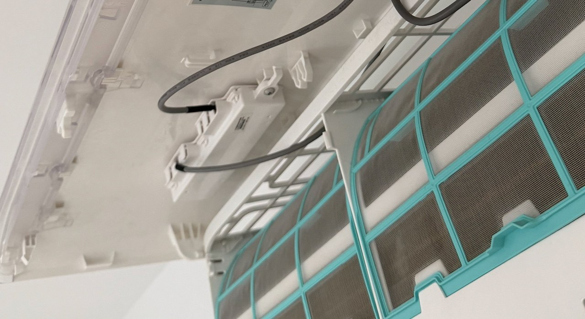

# Verdrahtung und Inbetriebnahme

> **Summary (EN).** Wiring and bring-up for one indoor unit with a LILYGO
> T-CAN485: four screw terminals, nothing to solder, powered from the 5 V pin on
> CN403. Contains the measured wire colours of the original Remko cable, the
> continuity checks to run before switching on, how to read the log during
> bring-up, and a troubleshooting table. Also documents the connector trap of
> the older build — CN403 and a generic module's TTL header are mechanically
> compatible but electrically incompatible.

---

## Hardware

| | |
|---|---|
| Board | **LILYGO T-CAN485** — ESP32 und RS-485-Transceiver auf einer Platine |
| Anschluss | Schraubklemmen für Bus und Versorgung |
| Versorgung | 5 V aus CN403, kein eigenes Netzteil |
| Je Gerät | ein Board, direkt am Innengerät |

**Ein ESP je Innengerät, kein Bus durch die Wohnung.** Das Handbuch beschreibt
eine durchgeschleifte Steuerleitung über alle Innengeräte. Für diesen Zweck ist
das unnötig: jeder ESP ist Master eines Busses mit genau einem Teilnehmer.
Vorteile: keine Leitung quer durch die Räume, keine Adressvergabe, kein Konflikt
mit einem eventuell später nachgerüsteten MCC-1.

**Warum ein Kombiboard statt drei Bauteile:** Der ursprüngliche Aufbau war
ESP32-DevKit plus separates XY-485-Modul plus Steckbrett, mit Serienwiderständen
in den TTL-Leitungen gegen die uneinheitliche `RXD`/`TXD`-Beschriftung solcher
Module. Das T-CAN485 ersetzt das komplett: vier Klemmen, nichts zu löten, kein
Steckbrett. Damit entfallen die Steckerfalle weiter unten, die Widerstandsfrage
und die Verwechslungsgefahr zwischen Bus- und TTL-Seite.

**Preis dafür:** Die drei Freigabepins des Boards müssen im YAML gesetzt werden
— `GPIO16/17/19`, alle active-low. Sie stehen als `output:` im Basispaket und
werden nie geschaltet; ESPHome setzt sie beim Start auf OFF, was mit
`inverted: true` physisch HIGH bedeutet. Steht das nicht drin, bleibt der
Transceiver stumm und **nichts im Log deutet darauf hin**.

---

## Verdrahtung

| CN403-Kabel | Signal | T-CAN485 |
|---|---|---|
| **braun** | 5V | `POWER DC 5~12V` **+** |
| **weiß** | E (Masse) | `POWER DC 5~12V` **−** |
| **rot** | X | `RS-485` **A** |
| **gelb** | Y | `RS-485` **B** |

Aderfarben am Original-Remko-Kabel gemessen. Beide Kabelhälften sind gleich
belegt, weil das Kabel eins zu eins durchverbunden ist. **Bei jedem neuen
Pigtail trotzdem einmal gegenklingeln**, bevor 5 V und E darauf liegen.


*Das Breakout `CE-AB.KEY(1.2)`: `CN701` nimmt das Originalkabel von CN403 auf,
der grüne Klemmenblock führt `X · Y · E · 5V` auf Schrauben. `CN401` und die
Stiftleisten `SWITCH` / `ON/OFF1` / `ON/OFF2` sind potentialfreie
Kontakteingänge mit Werksbrücken — hier nicht benötigt.*

Dem Gerät lagen bei: das Originalkabel von CN403 und das Breakout
`CE-AB.KEY(1.2)` mit `CN701` (4-polige JST-Buchse für das Originalkabel) und
einem grünen Klemmenblock **`X · Y · E · 5V`**. Damit wird nichts geschnitten
und nichts gelötet — **der Rückbau ist Abziehen**.



*Kabelführung hinter der Frontblende: Das Kabel verlässt den Anzeigebereich und
läuft am Rahmen entlang — **außerhalb des Luftwegs**, nicht über der
Kondensatwanne und mit Abstand zum Lüfter.*

### GPIO-Belegung des Boards (nicht anderweitig verwenden)

`GPIO21/22` UART · `GPIO16/17/19` Freigabepins · `GPIO26/27/23` CAN (ungenutzt)
· `GPIO04` WS2812. Die LED bleibt dunkel, weil sie nicht konfiguriert ist — das
ist kein Fehler. Frei sind `GPIO25, 32, 33, 05, 12, 34, 35, 18`.

---

## Vor dem Einschalten durchklingeln

Stromlos, Kabel gesteckt:

| von | nach | erwartet |
|---|---|---|
| CN403-Pin an IC5 **Pin 6** | Klemme **X** | Durchgang |
| CN403-Pin an IC5 **Pin 7** | Klemme **Y** | Durchgang |
| Masse | Klemme **E** | Durchgang |
| CN403-Pin an IC5 **Pin 8** | Klemme **5V** | Durchgang |
| Klemme **X** | Klemme **Y** | **kein** Durchgang |
| Klemme **5V** | Klemme **E** | **kein** Durchgang |

Danach, mit Spannung: Multimeter im DC-Bereich, 5-V-Klemme gegen `E` — es müssen
~5 V anliegen.

---

## Ablauf je Gerät

1. **Am Schreibtisch flashen**, per USB, ohne Klimagerät:
   ```bash
   esphome run ac-livingroom.yaml
   ```
2. **USB abziehen.** Nie gleichzeitig mit der 5-V-Versorgung aus CN403 — sonst
   speist das Board über seinen Regler in die Geräteschiene zurück.
3. **Sicherung des Innengeräts aus**, Spannungsfreiheit prüfen.
4. Vier Klemmen nach der Tabelle oben.
5. Einschalten, Log prüfen.

---

## Worauf im Log zu achten ist

Zum Mitlesen `logger: level: DEBUG` setzen und den `midea_xye`-Block im
Basispaket einkommentieren.

| Zeile | Bedeutung |
|---|---|
| `>>> AA C0 00 ...` | der ESP pollt, die Senderichtung steht |
| `<<< 00 00 00 ...` | **Rauschen**, keine Antwort — ein offener RX-Pin liest Dauer-Null |
| **`<<< AA ...`**, endet auf `55` | **echte Antwort des Innengeräts — bestanden** |
| `XYE-Adresse` erscheint | `auto_discover` hat das Gerät gefunden |
| nur `>>>`, nie `<<<` | keine Antwort → `A`/`B` tauschen |

Ein sauberer QUERY sieht so aus:

```
>>> AA C0 00 00 00 00 00 00 00 00 00 00 00 3F 01 55
```

Präambel `AA`, Kommando `C0` (QUERY), Ziel und Quelle `00`, Komplement `3F`
(= 0xFF − 0xC0), CRC, Abschluss `55`.

---

## Fehlersuche

| Symptom | Ursache | Abhilfe |
|---|---|---|
| Nur `>>>`, nie `<<<` | A/B vertauscht | rot und gelb an den RS-485-Klemmen tauschen |
| Gar keine Ausgabe, auch kein `>>>` | Freigabepins nicht gesetzt | `output:`-Block `GPIO16/17/19` mit `inverted: true` prüfen |
| `<<<` nur Nullen | RX-Pin offen, Transceiver nicht aktiv | dito |
| Board bootet nicht | Versorgung verpolt | braun = +, weiß = − gegenklingeln |
| Sporadische Resets | Versorgung grenzwertig | Stützkondensator 470–1000 µF an die Versorgungsklemmen |
| Frames kommen, aber keine Adresse | Gerät antwortet auf anderer Adresse | `auto_discover: true` lassen, S1/S2 nicht verstellen |

---

## Sicherheit beim Einbau

**Elektrisch**

* **Sicherung des Innengeräts aus, gegen Wiedereinschalten sichern,
  Spannungsfreiheit prüfen.** Bei Multisplit kann jedes Innengerät eine eigene
  Zuleitung haben — die richtige finden.
* Nach dem Abschalten ein bis zwei Minuten warten (Zwischenkreis-Elkos).
* Die Adapterplatine ist Kleinspannung, sitzt aber in Reichweite der
  Netzklemmen. Abstände einhalten, kein Werkzeug liegen lassen.
* ESD: vor dem Anfassen der Platine geerdetes Metall berühren.
* **Nie USB und die 5-V-Klemme gleichzeitig.**

**Mechanisch und klimatechnisch**

* **Kältekreis niemals anfassen.** Rohre, Verschraubungen, Wärmetauscher bleiben
  unberührt. Der Eingriff ist rein elektronisch im Anzeigebereich.
* Den ESP nicht in den Luftstrom, nicht an den Wärmetauscher und **nicht über
  die Kondensatwanne** setzen.
* Der geräteeigene IR-Empfänger muss frei bleiben, sonst funktioniert die
  Original-Fernbedienung nicht mehr.

**Reversibilität und Gewährleistung**

* Es wird **nichts verändert**, nur der vom Hersteller vorgesehene Stecker
  benutzt. Das entspannt die Gewährleistungsfrage erheblich — klärt sie aber
  nicht: bei bestehender Herstellergarantie oder Wartungsvertrag vorher fragen.
* **Keine Originalkabel schneiden.**
* Fotos vom Ist-Zustand vor dem Zerlegen. S1/S2-Stellung fotografieren.

**Vorgehen: erst eines, dann alle.** Ein Gerät komplett aufbauen, ein paar Tage
laufen lassen — Spannungseinbruch? WLAN stabil? Fernbedienung noch in Ordnung? —
und erst dann die übrigen.

---

## Anhang: die Steckerfalle des älteren Aufbaus

*Gilt für den Aufbau mit separatem XY-485-Modul. Dokumentiert, weil der Fehler
teuer gewesen wäre.*

CN403 liefert `5V · E · Y · X`, die TTL-Buchse solcher Module erwartet
`VCC · TXD · RXD · GND`. Beide sind 4-polig, gleiche Bauform — **das
CN403-Kabel lässt sich in die TTL-Buchse stecken.**

| Position | CN403 | Modul TTL | Folge |
|---|---|---|---|
| 1 | `5V` | `VCC` | zufällig harmlos |
| 2 | `E` (Masse) | `TXD` | Masse auf einem Logikausgang |
| 3 | `Y` (B) | `RXD` | Busleitung auf einen Logikeingang |
| 4 | `X` (A) | `GND` | **Busleitung direkt auf Masse** |

Grundregel: Die **Busseite** (X/Y, differenziell) gehört an die Schraubklemmen,
die **TTL-Seite** an den ESP. Wer den ESP an die Busseite hängt, überspringt den
Transceiver, der die beiden Welten überhaupt erst übersetzt. Ein GPIO misst
gegen Masse — bei einem differenziellen Signal ist der Pegel einer einzelnen
Ader mehrdeutig, und der Transceiver im Klimagerät treibt A/B bis 5 V, direkt in
die Schutzdiode eines 3,3-V-GPIO.

Wer so ein Modul einsetzt: **VCC an 3V3, nicht an 5 V** (die TTL-Pegel folgen der
Versorgung), Serienwiderstände 220–470 Ω in beide TTL-Leitungen gegen die
uneinheitliche `RXD`/`TXD`-Beschriftung, und `Earth` bleibt frei — der
Massebezug kommt schon über die Versorgungsleitung.
