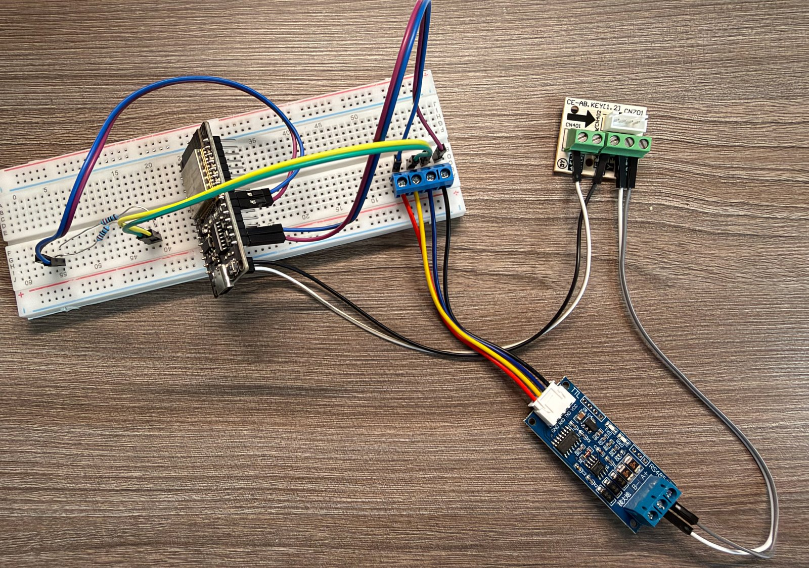

# Messprotokolle

> **Summary (EN).** What was actually measured on a running unit, not derived.
> Four results: (1) the 5 V rail on CN403 powers an ESP32-WROOM without a bulk
> capacitor, including at maximum cooling load; (2) that rail **stays live in
> standby**, which is what makes remote power-on possible at all; (3) the read
> path answered 39 of 39 frames with zero CRC errors, and a write from Home
> Assistant was accepted; (4) a byte-by-byte survey over 46 status frames shows
> that swing is only reflected, never driven, and that display brightness and
> the beeper do not appear on the bus at all.

---

## 1. Die 5-V-Schiene an CN403 trägt den ESP32

CN403 führt neben X/Y/E einen 5-V-Pin. Ob der einen ESP32 verträgt, ist
undokumentiert — die 5 V speisen im Original nur den Transceiver und die
Platinenlogik, zusammen vielleicht 20–40 mA. Ein ESP32-WROOM zieht im Betrieb
50–70 mA und beim WLAN-Senden **Spitzen von 250–500 mA** über ein bis zwei
Millisekunden.

Gemessen mit einem **ESP32-WROOM-32 direkt am 5-V-Pin**, versorgt über `VIN`,
**ohne Stützkondensator** — also im ungünstigsten Fall:

| Messgröße | Ergebnis |
|---|---|
| Reset-Grund | `power-on event` — **kein Brownout**, ein einziger Eintrag |
| Uptime | lückenlos steigend, **0 Rücksetzer** über die gesamte Messung |
| Boot-Loop-Zähler | `Boot seems successful` |
| WLAN | konstant −57 bis −60 dBm |
| Ping, 2-s-Intervall | 0 % Verlust |
| Warnungen / Fehler / Brownouts | **0** |

Belastungsfälle während der Messung: Kaltstart über die Sicherung mit
angeschlossenem ESP, Betrieb mit **maximaler Kühlleistung** inklusive
Kompressoranlauf, Moduswechsel.

**Ergebnis: kein separates Netzteil nötig.** Der Stützkondensator bleibt
trotzdem empfohlen — er hat sich hier zwar als nicht *notwendig* erwiesen,
kostet aber nichts und deckt Langzeit- und Temperatureffekte ab.

### Wer es am eigenen Gerät nachmessen will

Die Leerlaufspannung sieht immer gut aus; aussagekräftig wird es erst unter
Last. Dummy-Last aus 220-Ω-Widerständen parallel, je 22,7 mA und 0,11 W:

| Anzahl 220 Ω parallel | Strom | entspricht |
|---|---|---|
| 2 | ~45 mA | ESP im Leerlauf |
| 4 | ~90 mA | ESP32-WROOM mit WLAN, realistischer Dauerwert |
| 6 | ~135 mA | Sicherheitsreserve |

Leerlaufwert notieren, stufenweise 2 → 4 → 6 Widerstände dazuklemmen, jeweils
ablesen. **Abbrechen**, sobald die Spannung unter ~4,7 V fällt, das Display
flackert oder das Gerät zuckt; über ~200 mA nicht hinausgehen. Dann wiederholen,
während das Gerät **läuft** — die Schiene kann geteilt sein.

Bewertung: Einbruch < 0,2 V → reichlich Reserve. 0,2–0,4 V → geht, mit
Stützkondensator. Unter 4,7 V → eigenes Netzteil.

---

## 2. Die Schiene bleibt im Standby versorgt

Das war die letzte kritische Frage, und die eigentlich wichtige Messung: Wäre
die 5-V-Schiene im Standby abgeschaltet, verlöre der ESP beim Ausschalten die
Versorgung und könnte das Gerät **nie wieder einschalten** — eine
Fernsteuerung, die sich selbst aussperrt.

Gerät per Fernbedienung ausgeschaltet (nicht stromlos), drei Minuten gewartet,
wieder eingeschaltet:

| Messgröße | Ergebnis |
|---|---|
| Uptime über die Standby-Phase | 585 s → 765 s, 19 Messwerte im 10-s-Raster |
| Lücken im Uptime-Strom | **keine** |
| Rücksetzer | **0** |
| Reconnects / Fehler / Brownouts | **0** |

**Die Stromversorgung aus CN403 ist damit vollständig abgesichert.**

---

## 3. Lese- und Schreibpfad am echten Gerät

Aufbau: CN403 → Originalkabel → Breakout `CE-AB.KEY(1.2)` → RS-485-Modul →
ESP32, Versorgung aus der 5-V-Klemme des Breakouts.



*Der Aufbau, mit dem Lese- und Schreibpfad bewiesen wurden — noch die ältere
Hardware: ESP32-DevKit auf dem Steckbrett, separates RS-485-Modul (blau, mit
TTL-Buchse und A/B-Schraubklemmen) und rechts das Breakout, das über das
Originalkabel an CN403 hängt. Die Serienwiderstände in den TTL-Leitungen liegen
links auf dem Steckbrett. Das heutige T-CAN485 ersetzt alles bis auf das
Breakout.*

```
>>> AA C0 00 00 00 00 00 00 00 00 00 00 00 3F 01 55
<<< AA C4 00 00 00 00 05 00 02 30 08 00 00 00 00 00 08 01 12 00 00 00 00 00 00 00 00 00 00 00 E2 55
```

| | |
|---|---|
| Frames gesendet / beantwortet | **39 / 39**, keine Ausfälle |
| CRC-Fehler, Warnungen, Reconnects | **0** |
| Dekodiert | `QUERY_EXTENDED` (0xC4) mit `target_temperature: 18,00 °C`, `target_fan_speed: FAN_HIGH`, `esp_profile: ESP_MEDIUM`, `indoor_fan_pwm: 0x05` |

Die zahlreichen `-20.00 °C` sind der Platzhalter für „kein Wert" — Verflüssiger,
Heißgas, Außentemperatur und Kompressorfrequenz meldet das Gerät nur im Betrieb.

**Schreibtest bestanden:** Schalten aus Home Assistant, das Gerät reagiert.
Damit sind Lesen **und** Schreiben am echten Gerät bewiesen, nicht hergeleitet.

---

## 4. Nicht alles, was die Fernbedienung kann, steht auf dem Bus

Über 46 Statusframes wurden **alle 30 Bytes** beobachtet:

| Funktion | Auf dem XYE-Bus? | Konsequenz |
|---|---|---|
| Modus, Solltemperatur, Lüfterstufe | ja, lesen **und** schreiben | volle Steuerung |
| Ist-Temperaturen, Kompressor, Abtauen, Fehler | ja, lesen | echte Rückmeldung |
| **Swing** | nur passiv | einmal mit der Fernbedienung setzen, danach führt HA es dauerhaft mit |
| **Display-Helligkeit, Piepton** | **nein**, kein einziges Byte ändert sich | nur über die Fernbedienung |

### Swing — funktioniert, aber nur in eine Richtung

| Auslöser | Verhalten |
|---|---|
| **ESP setzt Swing** | Gerät quittiert `mode_flags = 0x04`, **bewegt die Lamelle aber nicht** und löscht das Flag nach ~4 s wieder. Die HA-Kachel springt dann auf „Off" zurück |
| **Fernbedienung setzt Swing** | Lamelle fährt, `mode_flags = 0x04` bleibt dauerhaft stehen |

Der Lamellenmotor hängt an der Logik der Anzeigeplatine; XYE spiegelt den
Zustand nur.

**Das Gute:** Der Empfangspfad der Komponente übernimmt `swing_mode` vom Gerät
und trägt es in jedes folgende SET-Kommando weiter. Gemessen über vier Minuten
und **zwei vollständige Aus-/Ein-Zyklen aus HA**: `mode_flags` blieb durchgehend
`0x04`, jedes SET — auch die Ausschaltbefehle — führte es mit.

→ **Einmal mit der Fernbedienung einschalten, danach bleibt es.**

Vertikal und horizontal lassen sich über XYE **nicht** unterscheiden: der Bus
kennt genau ein Swing-Bit (`ModeFlags::SWING = 0x04`), und der Empfangspfad
bildet es fest auf `CLIMATE_SWING_VERTICAL` ab. Deshalb steht in der Maske nur
`VERTICAL`; `HORIZONTAL` oder `BOTH` einzutragen würde nur eine Rückmeldung
erzeugen, die der Auswahl widerspricht.

### Display und Piepton — gar nicht auf dem Bus

Vollständige Durchsicht **aller 30 Bytes** über 46 Frames: TURBO, FRESH und die
LED-/Piepton-Taste ändern **kein einziges Byte**. `mode_flags` und
`operation_flags` bleiben konstant `0x00`.

Erklärbar: Displayhelligkeit und Quittungston sind Funktionen der
Anzeigeplatine, kein Betriebszustand, den eine Zentralsteuerung kennen müsste.

**Praktischer Nebenbefund:** Nach einem Aus-/Ein-Zyklus geht das Display wieder
an, der **Piepton bleibt aber weg**. Die Ton-Abschaltung ist dauerhaft
gespeichert.

### IR-Notausgang für genau diese Lücken

Die Komponente bringt dafür einen IR-Pfad mit: `midea_xye.swing_step`,
`midea_xye.display_toggle`, `midea_xye.beeper_on/off`. Alle brauchen einen
`remote_transmitter:` und eine IR-LED.

Die LED muss **nicht** in den Raum strahlen, sondern aus wenigen Zentimetern auf
den geräteeigenen IR-Empfänger auf der Anzeigeplatine — seitlich versetzt, damit
das IR-Fenster für die Fernbedienung frei bleibt, und mit deutlich größerem
Vorwiderstand (470 Ω–1 kΩ), weil die LED aus der Nähe sonst übersteuert.

---

## 5. Bekannte Einschränkungen des XYE-Wegs

Aus der Dokumentation der Komponente, damit es keine Überraschungen gibt:

* **Kein echter AUTO-Modus.** Das Innengerät kann nur HEAT oder COOL; die
  Auto-Umschaltung machte im Original der Midea-Thermostat. Über XYE ist das mit
  einer HA-Automation abzubilden.
* **Strommessung liefert immer 255.**
* **Silent/Turbo und Presets** sind definiert, aber noch ohne Wirkung.
